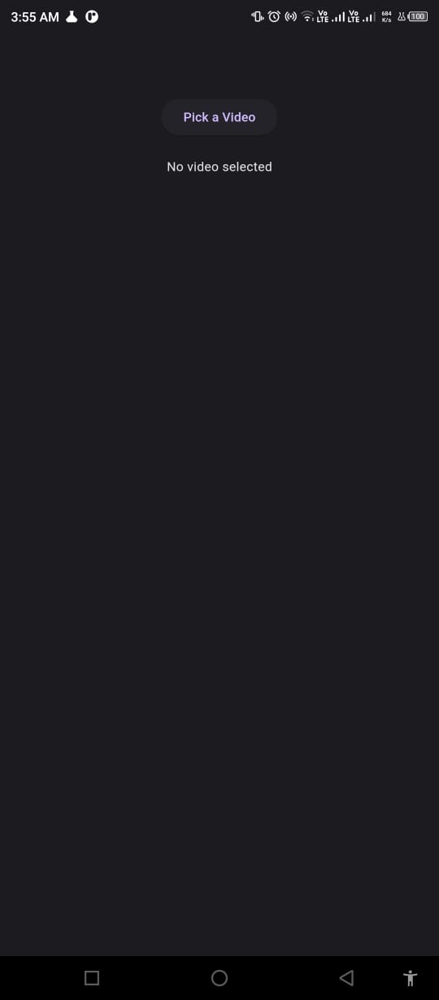
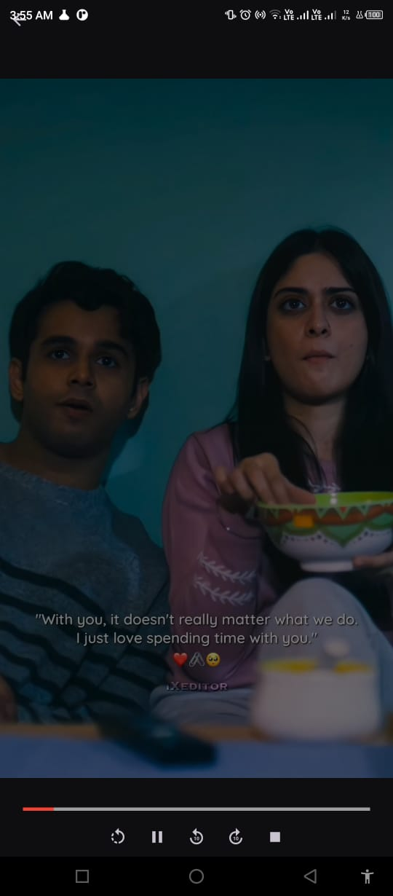

# Video Player App 🎥

The Video Player App is a Flutter application designed to provide users with a seamless experience for playing video files on their devices. With intuitive controls and smooth playback, users can easily select, play, and manage their video files with this app.


## Features 🚀

- **Pick Video**: Users can select a video file from their device storage.
- **Playback Controls**: Play, pause, stop, seek, and adjust volume during video playback.
- **Auto-hide Controls**: Video controls automatically hide after a few seconds of inactivity, providing an immersive viewing experience.
- **Screen Rotation**: Toggle between landscape and portrait mode for optimal viewing.
- **Customizable UI**: Adjust the appearance of the video progress indicator and controls to suit your preferences.

## Installation 🛠️

Follow these steps to set up and run the Video Player App on your local machine:

1. **Clone Repository**: 
    ```bash
    git clone https://github.com/your_username/video_player_app.git
    ```

2. **Navigate to Project Directory**:
    ```bash
    cd video_player_app
    ```

3. **Install Dependencies**:
    ```bash
    flutter pub get
    ```

4. **Run the App**:
    ```bash
    flutter run
    ```

## Usage ℹ️

1. **Launch the App**: Open the app on your device or emulator.
   
2. **Pick a Video**: Tap on the "Pick a Video" button to select a video file from your device storage.

3. **Playback Controls**: Once a video is selected, it will start playing automatically. Use the on-screen controls to play/pause, seek, and stop the video.

4. **Auto-hide Controls**: Video controls will automatically hide after a few seconds of inactivity. Tap on the video to show controls again.

5. **Screen Rotation**: Tap on the rotate button to switch between landscape and portrait mode for the best viewing experience.

6. **Enjoy Watching**: Sit back, relax, and enjoy watching your selected video!

## Screenshots 📸

<div style="display: flex; justify-content: space-between;">
  
  
</div>

## Contributing 🤝

Contributions are welcome! If you encounter any issues, have suggestions for improvements, or want to add new features, please feel free to open an issue or submit a pull request.

## License 📄

This project is licensed under the MIT License. See the [LICENSE](LICENSE) file for details.

## Acknowledgments 🙏

- Special thanks to the Flutter community for their support and contributions.
- Inspired by the need for a simple and efficient video player app for Flutter projects.

